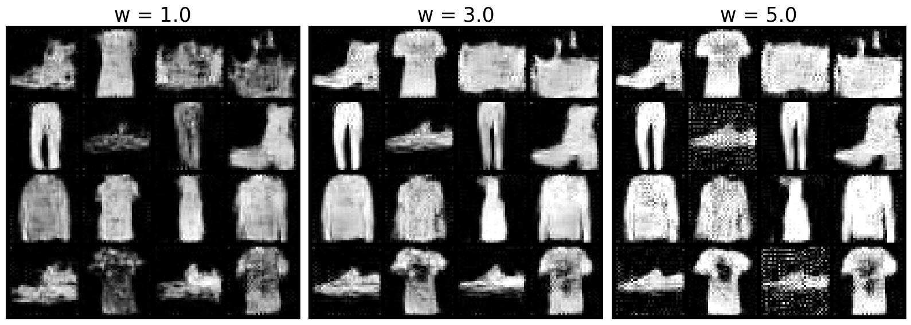

# Fashion MNIST Flow Matching
A simple implementation of Flow Matching for generative modeling on the Fashion-MNIST dataset, inspired by the MIT diffusion course.

## Overview

This project implements flow matching techniques for generating fashion item images using the Fashion-MNIST dataset. The implementation uses a U-Net architecture trained with flow matching to learn the transformation from noise to fashion images. This work is heavily inspired by (and builds upon) the excellent [MIT Diffusion Course](https://diffusion.csail.mit.edu/).

## Dataset

The project uses the Fashion-MNIST dataset, which contains:
- 60,000 training images
- 10,000 test images  
- 28x28 grayscale images of fashion items
- 10 classes: T-shirt/top, Trouser, Pullover, Dress, Coat, Sandal, Shirt, Sneaker, Bag, Ankle boot

## What is Flow Matching?

Flow matching is a generative modeling technique that learns to map between a simple source distribution (like Gaussian noise) and a complex target distribution (like fashion images). Instead of learning the transformation directly, it learns the velocity field that describes how to move points from the source to the target distribution.

## Architecture

The model uses a U-Net architecture commonly used in diffusion models, adapted for flow matching. The U-Net learns to predict the velocity field that transforms noise into fashion images following the flow matching paradigm.

## Getting Started

```bash
# Clone the repository
git clone https://github.com/TheHelltaker/Fashion_MNIST_flow.git
cd Fashion_MNIST_flow

# Install dependencies
pip install -r requirements.txt
```

## Usage

The main implementation is in a Jupyter notebook. Open and run the notebook to:
1. Load and preprocess the Fashion-MNIST dataset
2. Define the U-Net architecture
3. Train the flow matching model
4. Generate new fashion images

```bash
jupyter notebook  # Open the main notebook
```

## Results


The model learns to generate fashion item images by starting from random noise and following the learned flow field to produce realistic-looking clothing items.

## Acknowledgments

- Fashion-MNIST dataset by Zalando Research
- Implementation heavily inspired by the [MIT Diffusion Course](https://diffusion.csail.mit.edu/)
- Flow matching methodology from recent research in generative modeling

## Note

This is primarily an educational implementation based on course materials. The core ideas and much of the implementation approach come from the excellent MIT course on diffusion models.

## License

This project is for educational and research purposes.